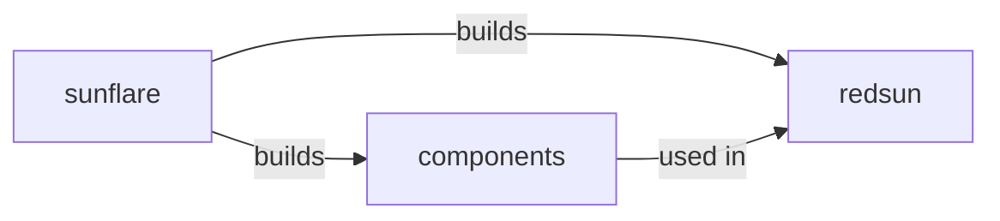

# Statement of need

The goal of `sunflare` is to provide shared and recognizable programming patterns accross the entire `redsun` ecosystem.
`redsun` heavily leverages the concept of components, and there is a need to provide a clear representation and a shared communication channel between the plugins that in the end build the desired application.

=== "Framework structure"

The diagram shows the relationship between `redsun`, `sunflare` and the custom components. Effectively, `redsun` is nothing more than "glue" code that constructs your custom application. What it does is:

- retrieve the user components via [Python entry points];
- build these components and catch any possible exception throw by them;
- build the final application and connecting all the components together.

This approach ensures that `sunflare` can be reused as a standalone package to provide reusable code to create custom control interfaces for your device, which fit the `bluesky` [message protocol] and [data model].

Furthermore, if you have an existing package for hardware control, `sunflare` can be used to create a wrapper for your classes which can then "talk" the `bluesky` language.

[python entry points]: https://packaging.python.org/en/latest/specifications/entry-points/
[message protocol]: https://blueskyproject.io/bluesky/main/msg.html
[data model]: https://blueskyproject.io/event-model/main/explanations/data-model.html
